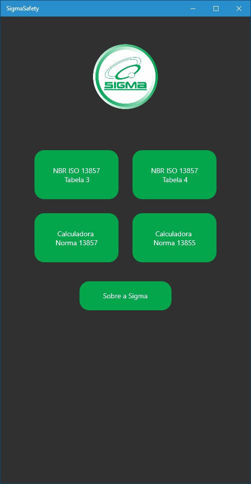
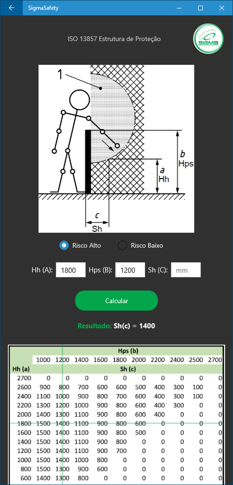
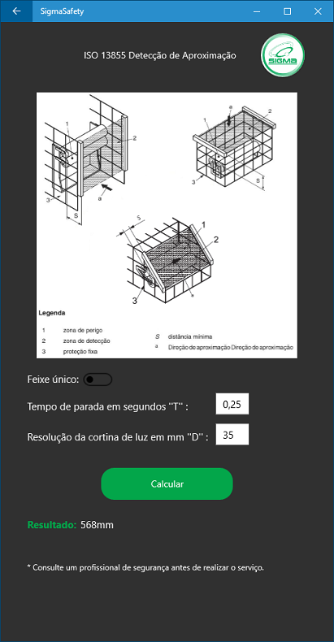
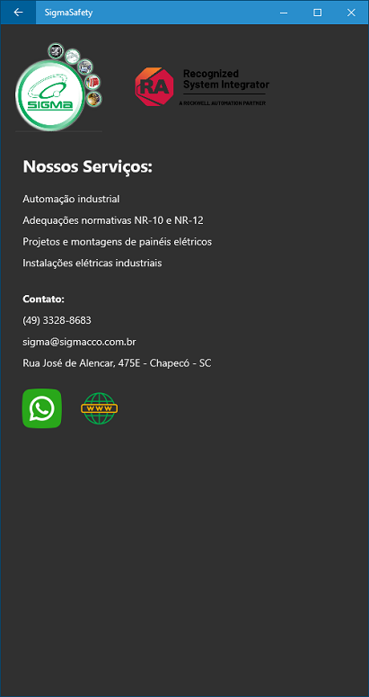

# SigmaSafety (Xamarin UWP)

Aplicativo desenvolvido para a Sigma Automação Industrial, empresa de Chapecó SC.

Este app foi desenvolvido para facilitar a consulta de tabelas e a realização de cálculos para se obter as distâncias de segurança segundo as normas da NR12.
Com ele ficou muito mais rápido e prático realizar consultas durante os projetos in loco.

 

